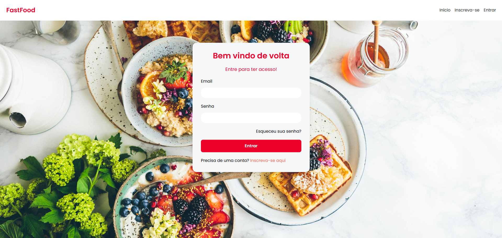
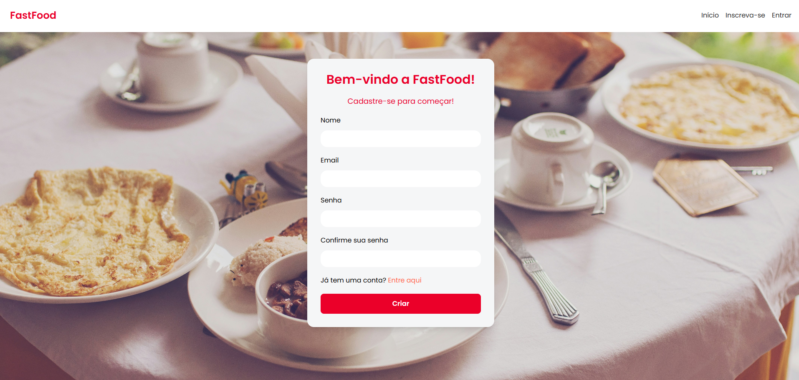
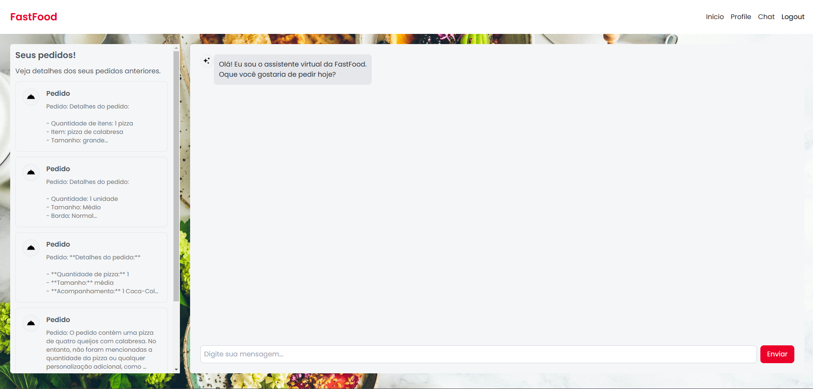

# 🍟 FastFood-Frontend

**FastFood-Frontend** é a interface de usuário do sistema FastFood, desenvolvido com **Next.js** e **Tailwind CSS**. O objetivo do aplicativo é fornecer uma plataforma simples e intuitiva para usuários se autenticarem, consultarem o cardápio e realizarem pedidos no restaurante.

## 🖥️ Tecnologias

- **Next.js**: Framework React para renderização do lado do servidor (SSR) e geração estática de páginas (SSG).
- **Tailwind CSS**: Framework de utilitário CSS para estilização rápida e responsiva.
- **React**: Biblioteca JavaScript para construir interfaces de usuário interativas.
- **OAuth2**: Implementação de autenticação e autorização para garantir que apenas usuários autenticados acessem certas funcionalidades.

## ⚙️ Funcionalidades

- **Cadastro de usuário**: Permite que os usuários se cadastrem para começar a fazer pedidos.
- **Login**: Usuários podem se autenticar para acessar o sistema.
- **Realize seu pedido**: Conversar com uma IA para decidir/registrar seus pedidos.
- **Consultar pedido**: Área para consultar pedidos anteriores.
- **Design responsivo**: A interface é adaptável a diferentes tamanhos de tela, proporcionando uma boa experiência em dispositivos móveis e desktop.

## 📁 Estrutura de Diretórios

- **`app/`**: Contém as páginas do aplicativo, incluindo a página de login, criação de conta e outras telas do sistema.
- **`components/`**: Contém os componentes reutilizáveis, como o cabeçalho e os formulários.
- **`lib/`**: Contém os arquivos de estilos globais do aplicativo.
- **`store/`**: Contém arquivos públicos, como imagens e ícones.

## 🎨 Este projeto utiliza o **Tailwind CSS** para estilização, e as cores estão definidas no arquivo `tailwind.config.js`:

- **`ct-primary`**: Cor principal, vermelha (#EB0029).
- **`ct-secondary`**: Cor do degradê (substituída por outras cores conforme escolha).
- **`ct-dark-600`**: Cor escura (#222).
- **`ct-dark-200`**: Cor intermediária clara (#e5e7eb).

## ⚙️ Como rodar o projeto?

### 1️⃣ Configure o ambiente:
Transforme o arquivo .env.example em .env

### 2️⃣ Instale as dependências:

```bash
npm install
```

### 3️⃣ Execute o aplicativo:

```bash
npm run dev
```

## Preview
### 🛡️ Autenticação


### 🤖 IA Chat
